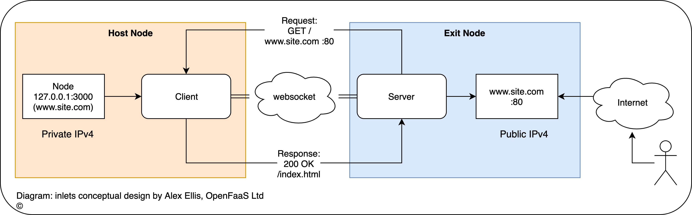

# inlets OSS

Cloud Native Tunnel written in Go

What's this for? Exposing your local endpoints to the Internet or to another network, traversing firewalls and NAT.

[](https://travis-ci.com/inlets/inlets)
[](https://opensource.org/licenses/MIT)
[](https://goreportcard.com/report/github.com/inlets/inlets)
[](http://godoc.org/github.com/inlets/inlets)
[](https://gitpod.io/from-referrer/)


## Intro


inlets combines a reverse proxy and websocket tunnels to expose your internal and development endpoints to the public Internet via an exit-node. An exit-node may be a 5-10 USD VPS or any other computer with an IPv4 IP address.

Why do we need this project? Similar tools such as [ngrok](https://ngrok.com/) or [Argo Tunnel](https://developers.cloudflare.com/argo-tunnel/) from [Cloudflare](https://www.cloudflare.com/) are closed-source, have limits built-in, can work out expensive, and have limited support for arm/arm64. Ngrok is also often banned by corporate firewall policies meaning it can be unusable. Other open-source tunnel tools are designed to only set up a single static tunnel. inlets aims to dynamically bind and discover your local services to DNS entries with automated TLS certificates to a public IP address over a websocket tunnel.

When combined with SSL - inlets can be used with any corporate HTTP proxy which supports `CONNECT`.



*Conceptual diagram for inlets*

## License & terms

**Important**

Developers wishing to use inlets within a corporate network are advised to seek approval from their administrators or management before using the tool. By downloading, using, or distributing inlets, you agree to the [LICENSE](./LICENSE) terms & conditions. No warranty or liability is provided.

### Who is behind this project?

inlets is brought to you by [Alex Ellis](https://twitter.com/alexellisuk). Alex is a [CNCF Ambassador](https://www.cncf.io/people/ambassadors/) and the founder of [OpenFaaS](https://github.com/openfaas/faas/).

> [OpenFaaS&reg;](https://github.com/openfaas/faas) makes it easy for developers to deploy event-driven functions and microservices to Kubernetes without repetitive, boiler-plate coding. Package your code or an existing binary in a Docker image to get a highly scalable endpoint with auto-scaling and metrics. The project has around 19k GitHub stars, over 240 contributors and a growing number of end-users in production.

### Backlog & goals

#### Completed

* automatically create endpoints on exit-node based upon client definitions
  * multiplex sites on same port and websocket through the use of DNS / host entries
* link encryption using SSL over websockets (`wss://`)
* automatic reconnect
* authentication using service account or basic auth
* automatic TLS provisioning for endpoints using [cert-magic](https://github.com/mholt/certmagic)
  * configure staging or production LetsEncrypt issuer using HTTP01 challenge
* native multi-arch with ARMHF/ARM64 support
* Dockerfile and Kubernetes YAML files
* discover and implement `Service` type of `LoadBalancer` for Kubernetes - [inlets-operator](https://github.com/inlets/inlets-operator)
* tunnelling websocket traffic in addition to HTTP(s)
* [get a logo for the project](https://github.com/inlets/inlets/issues/46)

#### Stretch goals

* automatic configuration of DNS / A records
* configuration to run "exit-node" as serverless container with Azure ACI / AWS Fargate
* configure staging or production LetsEncrypt issuer using DNS01 challenge

#### Non-goals

* tunnelling plain TCP traffic over the websocket

  This use-case is covered by inlets-pro, ask me about early access to [inlets-pro](mailto:alex@openfaas.com).

### Status

Unlike HTTP 1.1 which follows a synchronous request/response model websockets use an asynchronous pub/sub model for sending and receiving messages. This presents a challenge for tunneling a *synchronous protocol* over an *asynchronous bus*.

inlets 2.0 introduces performance enhancements and leverages parts of the Kubernetes and Rancher API. It uses the same tunnelling packages that enable node-to-node communication in [Rancher's k3s project](https://k3s.io). It is suitable for development and may be useful in production. Before deploying `inlets` into production, it is advised that you do adequate testing.

Feel free to open issues if you have comments, suggestions or contributions.

* The tunnel link is secured via `--token` flag using a shared secret
* The default configuration uses websockets without SSL `ws://`, but to enable encryption you could enable SSL `wss://`
* A timeout for requests can be configured via args on the server
* ~~The upstream URL has to be configured on both server and client until a discovery or service advertisement mechanism is added~~ The client can advertise upstream URLs, which it can serve
* The tunnel transport is wrapped by default which strips CORS headers from responses, but you can disable it with the `--disable-transport-wrapping` flag on the server

### Related projects

Inlets is [listed on the Cloud Native Landscape](https://landscape.cncf.io/category=service-proxy&format=card-mode&grouping=category&sort=stars) as a Service Proxy

* [inlets](https://github.com/inlets/inlets) - open-source L7 HTTP tunnel and reverse proxy
* [inlets-pro](https://github.com/inlets/inlets-pro-pkg) - L4 TCP load-balancer
* [inlets-operator](https://github.com/inlets/inlets-operator) - deep integration for inlets in Kubernetes, expose Service type LoadBalancer
* [inletsctl](https://github.com/inlets/inletsctl) - CLI tool to provision exit-nodes for use with inlets or inlets-pro

### What are people saying about inlets?

> You can share about inlets using `@inletsdev`, `#inletsdev`, and `https://inlets.dev`.

inlets has trended on the front page of Hacker News twice.

* [inlets 1.0](https://news.ycombinator.com/item?id=19189455) - 146 points, 48 comments
* [inlets 2.0](https://news.ycombinator.com/item?id=20410552) - 218 points, 66 comments

Official tutorials:
* [HTTPS for your local endpoints with inlets and Caddy - Alex Ellis](https://blog.alexellis.io/https-inlets-local-endpoints/)
* [Build a 10 USD Raspberry Pi Tunnel Gateway](https://blog.alexellis.io/raspberry-pi-zero-tunnel-gateway/)
* [Get a LoadBalancer for your private Kubernetes cluster with inlets-operator - Alex Ellis](https://blog.alexellis.io/ingress-for-your-local-kubernetes-cluster/)
* [Webhooks, great when you can get them - Alex Ellis](https://blog.alexellis.io/webhooks-are-great-when-you-can-get-them/)

Community tutorials:
* [The Awesomeness of Inlets by Ruan Bekker](https://sysadmins.co.za/the-awesomeness-of-inlets/)
* [K8Spin - What does fit in a low resources namespace? Inlets](https://medium.com/k8spin/what-does-fit-in-a-low-resources-namespace-3rd-part-inlets-6cc278835e57)
* [Exposing Magnificent Image Classifier with inlets](https://blog.baeke.info/2019/07/17/exposing-a-local-endpoint-with-inlets/)
* ["Securely access external applications as Kubernetes Services, from your laptop or from any other host, using inlets"](https://twitter.com/BanzaiCloud/status/1164168218954670080)
* [Setting up an EC2 Instance as an Inlets Exit Node](https://mbacchi.github.io/2019/08/21/inlets-aws-ec2.html)
* [Micro-tutorial inlets with KinD by Alex Ellis](https://gist.github.com/alexellis/c29dd9f1e1326618f723970185195963)
* [Using local services in Gitpod with inlets](https://www.gitpod.io/blog/local-services-in-gitpod/)
* [Setting up a GCE Instance as an Inlets Exit Node](https://pretired.dazwilkin.com/posts/200122/)
* [Scheduling Kubernetes workloads to Raspberry Pi using Inlets and Crossplane](https://github.com/crossplaneio/tbs/blob/master/episodes/9/assets/README.md) by [Daniel Mangum](https://github.com/hasheddan)
  * Also checkout the live [demo](https://youtu.be/RVAFEAnirZA)
* [Micro-tutorial inlets with minikube and Free plan IBM Kubernetes Services (IKS)](https://github.com/csantanapr/inlets-iks-to-minikube-tutorial/blob/master/README.md) by [Carlos Santana](https://twitter.com/csantanapr)

Twitter:

* ["I just transferred a 70Gb disk image from a NATed NAS to a remote NATed server with @alexellisuk inlets tunnels and a one-liner python web server" by Roman Dodin](https://twitter.com/ntdvps/status/1143071544203186176)
* ["Really amazed by inlets by @alexellisuk - "Up and running in 15min - I will be able to watch my #RaspberryPi servers running at home while staying on the beach 🏄‍♂️🌴🍸👏👏👏" by Florian Dambrine](https://twitter.com/DambrineF/status/1158364581624012802?s=20)
* [Testing an OAuth proxy by Vivek Singh](https://twitter.com/viveksyngh/status/1142054203478564864)
* [inlets used at KubeCon to power a live IoT demo at a booth](https://twitter.com/tobruzh/status/1130421702914129921)
* [PR to support Risc-V by Carlos Eduardo](https://twitter.com/carlosedp/status/1140740494617645061)
* [Recommended by Michael Hausenblas for use with local Kubernetes](https://twitter.com/mhausenblas/status/1143020953380753409)
* [5 top facts about inlets by Alex Ellis](https://twitter.com/alexellisuk/status/1140552115204608001)
* ["Cool! I hadn't heard of inlets until now, but I love the idea of exposing internal services this way. I've been using TOR to do this!" by Stephen Doskett, Tech Field Day](https://twitter.com/SFoskett/status/1108989190912524288)
* ["Learn how to set up HTTPS for your local endpoints with inlets, Caddy, and DigitalOcean thanks to @alexellisuk!" by @DigitalOcean](https://twitter.com/digitalocean/status/1113440166310502400)
* ["See how Inlets helped me to expose my local endpoints for my homelab that sits behind a Carrier-Grade NAT"](https://twitter.com/ruanbekker/status/1161399537417801728)

> Note: add a PR to send your story or use-case, I'd love to hear from you.

See [ADOPTERS.md](./ADOPTERS.md) for what companies are doing with inlets today.

## Get started

You can install the CLI with a `curl` utility script, `brew` or by downloading the binary from the releases page. Once installed you'll get the `inlets` command.

### Install the CLI

> Note: `inlets` is made available free-of-charge, but you can support its ongoing development through [GitHub Sponsors](https://insiders.openfaas.io/) 💪

Utility script with `curl`:

```bash
# Install to local directory
curl -sLS https://get.inlets.dev | sh

# Install to /usr/local/bin/
curl -sLS https://get.inlets.dev | sudo sh
```

Via `brew`:

```bash
brew install inlets
```

> Note: the `brew` distribution is maintained by the brew team, so it may lag a little behind the GitHub release.

Binaries are made available on the [releases page](https://github.com/inlets/inlets/releases) for Linux (x86_64, armhf & arm64), Windows (experimental), and for Darwin (MacOS). You will also find SHA checksums available if you want to verify your download.

Windows users are encouraged to use [git bash](https://git-scm.com/downloads) to install the inlets binary.

### Quickstart tutorial

You can run inlets between any two computers with connectivity, these could be containers, VMs, bare metal or even "loop-back" on your own laptop.

See [how to provision an "exit-node" with a public IPv4 address using a VPS](./docs/vps.md).

* On the *exit-node* (or server)

Start the tunnel server on a machine with a publicly-accessible IPv4 IP address such as a VPS.

Example with a token for client authentication:

```bash
export token=$(head -c 16 /dev/urandom | shasum | cut -d" " -f1)
inlets server --port=8090 --token="$token"
```

> Note: You can pass the `--token` argument followed by a token value to both the server and client to prevent unauthorized connections to the tunnel.


```bash
inlets server --port=8090
```

You can also run unprotected, but this is not recommended.

Note down your public IPv4 IP address.

* Head over to your machine where you are running a sample service, or something you want to expose.

You can use my hash-browns service for instance which generates hashes.

Install hash-browns or run your own HTTP server

```sh
export GO111MODULE=off
export GOPATH=$HOME/go/

go get -u github.com/alexellis/hash-browns
port=3000 $GOPATH/bin/hash-browns
```

If you don't have Go installed, then you could run [Python's built-in HTTP server](https://docs.python.org/2/library/simplehttpserver.html):

```sh
mkdir -p /tmp/inlets-test/
cd /tmp/inlets-test/
touch hello-world
python -m SimpleHTTPServer 3000
```

* On the same machine, start the inlets client

Start the tunnel client:

```sh
export REMOTE="127.0.0.1:8090"    # for testing inlets on your laptop, replace with the public IPv4
export TOKEN="CLIENT-TOKEN-HERE"  # the client token is found on your VPS or on start-up of "inlets server"
inlets client \
 --remote=$REMOTE \
 --upstream=http://127.0.0.1:3000 \
 --token $TOKEN
```

* Replace the `--remote` with the address where your exit-node is running `inlets server`.
* Replace the `--token` with the value from your server

We now have three processes:
* example service running (hash-browns) or Python's webserver
* an exit-node running the tunnel server (`inlets server`)
* a client running the tunnel client (`inlets client`)

So send a request to the inlets server - use its domain name or IP address:

Assuming `gateway.mydomain.tk` points to `127.0.0.1` in `/etc/hosts` or your DNS server.

```sh
curl -d "hash this" http://127.0.0.1:8090/hash -H "Host: gateway.mydomain.tk"
# or
curl -d "hash this" http://127.0.0.1:8090/hash
# or
curl -d "hash this" http://gateway.mydomain.tk/hash
```

You will see the traffic pass between the exit node / server and your development machine. You'll see the hash message appear in the logs as below:

```sh
~/go/src/github.com/alexellis/hash-browns$ port=3000 go run server.go
2018/12/23 20:15:00 Listening on port: 3000
"hash this"
```

Now check the metrics endpoint which is built-into the hash-browns example service:

```sh
curl $REMOTE/metrics | grep hash
```

You can also use multiple domain names and tie them back to different internal services.

Here we start the Python server on two different ports, serving content from two different locations and then map it to two different Host headers, or domain names:

```sh
mkdir -p /tmp/store1
cd /tmp/store1/
touch hello-store-1
python -m SimpleHTTPServer 8001 &


mkdir -p /tmp/store2
cd /tmp/store2/
touch hello-store-2
python -m SimpleHTTPServer 8002 &
```

```sh
export REMOTE="127.0.0.1:8090"    # for testing inlets on your laptop, replace with the public IPv4
export TOKEN="CLIENT-TOKEN-HERE"  # the client token is found on your VPS or on start-up of "inlets server"
inlets client \
 --remote=$REMOTE \
 --token $TOKEN \
 --upstream="store1.example.com=http://127.0.0.1:8001,store2.example.com=http://127.0.0.1:8002"
```

You can now create two DNS entries or `/etc/hosts` file entries for `store1.example.com` and `store2.example.com`, then connect through your browser.

## Going further

### Docs & Featured tutorials

Tutorial: [HTTPS for your local endpoints with inlets and Caddy](https://blog.alexellis.io/https-inlets-local-endpoints/)

Docs: [Inlets & Kubernetes recipes](./docs/kubernetes.md)

Docs: [Run Inlets on a VPS](./docs/vps.md)

Tutorial: [Get a LoadBalancer for your private Kubernetes cluster with inlets-operator](https://blog.alexellis.io/ingress-for-your-local-kubernetes-cluster/)

### Video demo

Using inlets I was able to set up a public endpoint (with a custom domain name) for my JavaScript & Webpack [Create React App](https://github.com/facebook/create-react-app).

[](https://youtu.be/jrAqqe8N3q4)

### Docker

Docker images are published as multi-arch for `x86_64`, `arm64` and `armhf`

* `inlets/inlets:2.6.3`

### Multiple services with on exit-node

You can expose an OpenFaaS or OpenFaaS Cloud deployment with `inlets` - just change `--upstream=http://127.0.0.1:3000` to `--upstream=http://127.0.0.1:8080` or `--upstream=http://127.0.0.1:31112`. You can even point at an IP address inside or outside your network for instance: `--upstream=http://192.168.0.101:8080`.

When using the scripts in `hack` to configure inlets with system, the process will restart if the tunnel crashes.

### Bind a different port for the control-plane

You can bind two separate TCP ports for the user-facing port and the tunnel.

* `--port` - the port for users to connect to and for serving data, i.e. the *Data Plane*
* `--control-port` - the port for the websocket to connect to i.e. the *Control Plane*

## Development

For development you will need Golang 1.10 or 1.11 on both the exit-node or server and the client.

You can get the code like this:

```bash
go get -u github.com/inlets/inlets
cd $GOPATH/src/github.com/inlets/inlets
```

Alternatively, you can get everything setup right in the browser with a single click using [Gitpod](https://gitpod.io):

[](https://gitpod.io/#https://github.com/inlets/inlets)

Contributions are welcome. All commits must be signed-off with `git commit -s` to accept the [Developer Certificate of Origin](https://developercertificate.org).

### Appendix

Other Kubernetes port-forwarding tooling:

* [`kubectl port-forward`](https://kubernetes.io/docs/tasks/access-application-cluster/port-forward-access-application-cluster/) - built into the Kubernetes CLI, forwards a single port to the local computer.
* [kubefwd](https://github.com/txn2/kubefwd) - Kubernetes utility to port-forward multiple services to your local computer.
* [kurun](https://github.com/banzaicloud/kurun) - Run main.go in Kubernetes with one command, also port-forward your app into Kubernetes.
